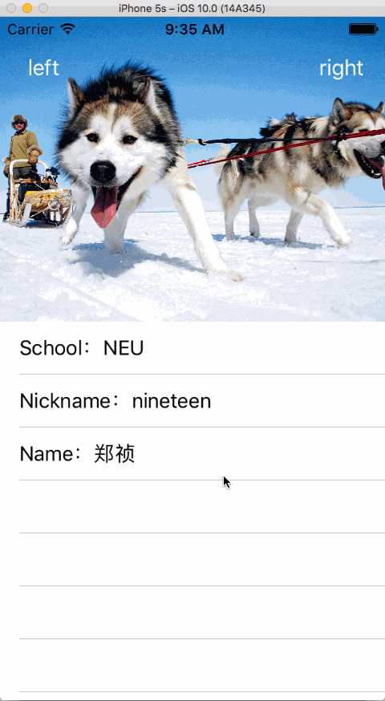

# NTHeaderStretchingTableViewController
####这是一个封装好的具有主流头部拉伸效果的UITableViewController####
* 使用方法：直接将这个类放入项目，然后将需要制作这种效果的类继承与这个类，设置相关属性即可，具体如下：
	
	```
	// 将父控制器中的属性设置放在super的viewDidLoad之前
    self.headerImageHeight = 200;
    self.headerImageName = @"husky";
    self.navigationBackgroundImageName = @"navigationBackground";
    
    [super viewDidLoad];
    
	```

* 效果展示：

    